# UnitBites-showcase

## In a Nutshell
This repository contains a showcase of my project **UnitBites**, with selected code snippets and documentation.  
The full source code is private, but I’d be happy to provide access or a demo to recruiters or hiring managers upon request.  

If you’d like to see the full implementation, please contact me at [📩](mailto:libronika@gmail.com)

Test this app yourself: [www.unitbites.eu](https://www.unitbites.eu/)

## Table of Contents

 1. [About UnitBites](#about-unitbites)
 2. [Demo](#demo)
 3. [Features](#features)
 4. [Tech Stack](#tech-stack)
 5. [Architecture Overview](#architecture-overview)
 6. [Selected Code Snippets](#selected-code-snippets)
 7. [Future Improvements](#future-improvements)

## About UnitBites

UnitBites is a web application built with home cooks in mind. It is a go to place to recalculate and store recipes. 
On top of it, users have an option to donwload a recipe as in a PDF format - quite useful for cooking and grocery shopping.

## Demo

The project is currently live, feel free to check it out yourself: [www.unitbites.eu](https://www.unitbites.eu/).
Please note backend is currently running on Render free tier, so cold start is to be expected.

#### Key Views


## Features

- Create/update/delete user account
- Recalculate recipes between imperial and metric systems
- Save recalculated recipes
- Filter recipes by favorite and/or recipe title
- Sort recipes by date
- Download recipe in a PDF format
- Delete recipe
- Light/Dark mode

More to come... 

## Tech Stack

1. Frontend:
    - React & Vite
    - JS
    - CSS
    - HTML5
3. Backend:
    - Python
    - Flask
5. Data:
    - SQLAlchemy
    - PostgreSQL
7. User Management:
    - Clerk
9. Version Control:
    - Git
    - GitHub

## Architecture Overview

```mermaid
flowchart TD
    User[👤 User] -->|Browser| Frontend

    subgraph Frontend [🌐 Frontend - Vercel]
        FE[React + Vite]
        FE <--> ClerkSDK[🔑 Clerk SDK]
    end

    subgraph Backend [⚙️ Backend - Render]
        BE[Python + Flask]
        BE <--> DB[(🗄️ PostgreSQL - Render)]
        BE <--> ClerkAPI[(Clerk API ☁️)]
    end

    FE <--> BE
    ClerkSDK <--> ClerkAPI

```



## Selected Code Snippets

### Highlights
- Backend: Webhook-driven user lifecycle & ingredient parser
- Frontend: Protected routes and API integration
- Full-stack auth flow with Clerk

### Webhook-Driven User Lifecycle

Clerk sends webhook events when users are created or deleted.
Backend listens on /clerk/webhook, verifies the signature with svix, and updates database accordingly.
```python
# highlight from examples/clerk_webhook.py

@webhook_bp.route('/clerk/webhook', methods=['POST'])
def handle_clerk_webhook():
    try:
        wh = Webhook(signing_secret)
        evt = wh.verify(request.get_data(), headers=request.headers)
    except WebhookVerificationError:
        return {"error": "Invalid signature"}, 400

    event_type = evt['type']
    user_id = evt['data'].get('id')

    if event_type == 'user.deleted':
        manager.delete_user(user_id)
    elif event_type == 'user.created':
        helper.register_clerk_user(user_id, ...)
    
    return {"received": event_type}, 200
```
[Full webhook implementation →](examples/clerk_webhook.py)

### Ingredients Parser
this function:
 - Handles fractions (½ cup sugar)
 - Handles ranges (1–2 jalapeños)
 - Handles subamounts (2 28-oz cans)
 - Normalizes units (tbsp → tablespoon)
 - Returns structured data for further processing
```python
# highlight from examples/parser.py

from ingredient_parser import parse

raw = "2 28-oz cans tomatoes\n1-2 jalapeños"
print(parse(raw))
# → [{'amount_min': 2.0, 'amount_max': 2.0, 'unit': 'oz', 'item': 'cans tomatoes'}, ...]
```
[Full parser implementation →](examples/parser.py)

### Protecting Routes (Frontend)

The app uses a `PrivateRoute` wrapper to ensure only signed-in users can access certain pages:

```jsx
// usage of PrivateRoute from examples/PrivateRoute.jsx

<Route path="user" element={
  <PrivateRoute>
    <UserProfile />
  </PrivateRoute>
} />

<Route path="recipes" element={
  <PrivateRoute>
    <UserRecipes />
  </PrivateRoute>
} />
```
[Full PrivateRoute implementation →](examples/PrivateRoute.jsx)

### API GET Call:
An example of an API call to fetch all recipes for authorized user:

```jsx
// usage in examples/UserRecipes.jsx

export function fetchUserRecipes(token) {
    return fetch(`${API_BASE_URL}/api/user/recipes`, {
        method: 'GET',
        headers: { Authorization: `Bearer ${token}` }
    })
    .then(res => {return res.json()})
    .catch(err => console.error('Error when fetching:', err))
  }
```
[Full UserRecipes implementation →](examples/USerRecipes.jsx)

## Future Improvements

- Social logins beyond Google (Microsoft, Apple, etc.)
- Tags and tag based search
- Ingredient substitution suggestions
- Faster recalculation with LLM
- Recipe resizing
  


